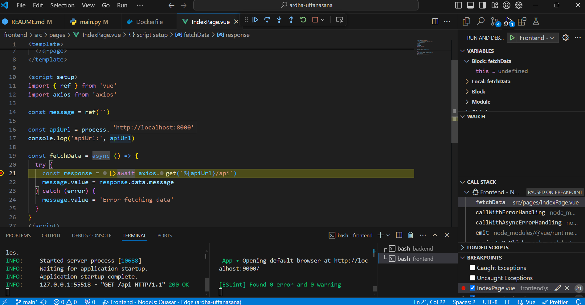

# Ardha-uttanasana

This is a "Hello World" using Python/[FastApi](https://fastapi.tiangolo.com/) in the backend and VueJs/[Quasar](https://quasar.dev/) in the frontend, running in a single container. 

The main contribution here is to show how to integrate these technologies in two flavors:
- Local run and debug with Vscode, for the sake of developer's life quality.
- Deployment via a single Dockerfile. So, **it can be easily deployed on platforms with free plans** (like [Render](https://render.com/)) as a starting point.

> Ardha-uttanasana is a beginner friendly yoga posture, just like this repo 😉

Live links: (This is a free hosting. It can take up to 1min to start.)
- Frontend: https://ardha-uttanasana.onrender.com
- Backend: https://ardha-uttanasana.onrender.com/api
- Swagger: https://ardha-uttanasana.onrender.com/docs

## Requirements
- Vscode
- Git bash
- Python 3.12, including pipenv
- Node 18 or higher
- Docker Desktop (so you can troubleshoot the Dockerfile is necessary)

## Local run and debug

- Frontend: http://localhost:9000/ 
- Backend: http://localhost:8000/api
- Swagger: http://localhost:8000/docs

### Backend setup
- Open the root folder of this project on VsCode and the integrated terminal (gitbash)
- `cd backend`
- `mkdir .venv` (so it installs the virtual environment on this subfolder).
- `pipenv install --dev`
- F1: Developer reload. Pick the virtual environment you have just installed. 

### Backend run

- In the integrated terminal, on the backend folder, type `/run.sh` (or `pipenv run uvicorn main:app --reload`)
- http://localhost:8000/api should return

`{
    "message": "BACKEND_ENV_VAR content: No variable set!"
}`

- If you quit the app (CTRL+C) and change the BACKEND_ENV_VAR variable via terminal (`export BACKEND_ENV_VAR="hello world"`). This new value will appear on the response.
- http://localhost:8000/docs should show the Swagger documentation.

### Backend debug

- Place a breakpoint on `.\backend\main.py`, for instance at the return of the sample_route.
- On "Run and debug" (Ctrl+Shift+D), selected Backend
- Hit F5 and go to http://localhost:8000/api - It should stop in your breakpoint

### Frontend setup
- `cd frontend`
- `npm install`
- F1: Developer reload. 

### Frontend run
- Leave the backend running. 
- In the integrated terminal, on the frontend folder, type `/run.sh` (or `quasar dev`)
- Go to http://localhost:9000/#/

### Frontend debug
- Place a breakpoint on .`\frontend\src\pages\IndexPage.vue`, for instance inside fetchData.
- Leave the backend running. 
- Leave the frontend running and close the browser.
- On "Run and debug" (Ctrl+Shift+D), selected "Frontend"
- Hit F5 and go to http://localhost:9000/ . If you click on fetch data button, it should stop in your breakpoint.

## Run docker locally (optional)
- On the root folder of this project, in the integrated terminal 
- `docker build --no-cache --build-arg BACKEND_ENV_VAR="Hello world via docker!" -t myapp:latest .`
- `docker run -it --rm -p 8000:8000 --name myapp-container myapp:latest`
- If everything is fine, you'll see the following in the browser once you click in the button.

- Frontend: http://localhost:8000/ 
- Backend:http://localhost:8000/api
- Swagger: http://localhost:8000/docs

## Deploy on Render with Dockerfile 

- Choose New Web Server. 
- All default configurations.
- Add BACKEND_ENV_VAR as secret. 

## Lessons learned and notes

-  This is how you add environment variables on Quasar: https://quasar.dev/quasar-cli-webpack/handling-process-env#example.

- You need to adjust the Dockerfile to pass the variables to the container.

- These are the environment variables available on Render:  https://docs.render.com/environment-variables#by-runtime

- It was tested on Windows, but I guess it should be adapatable to Linux or Mac without much problem.

- If you need a full-stack template, please refer to https://github.com/tiangolo/full-stack-fastapi-template ❤️

