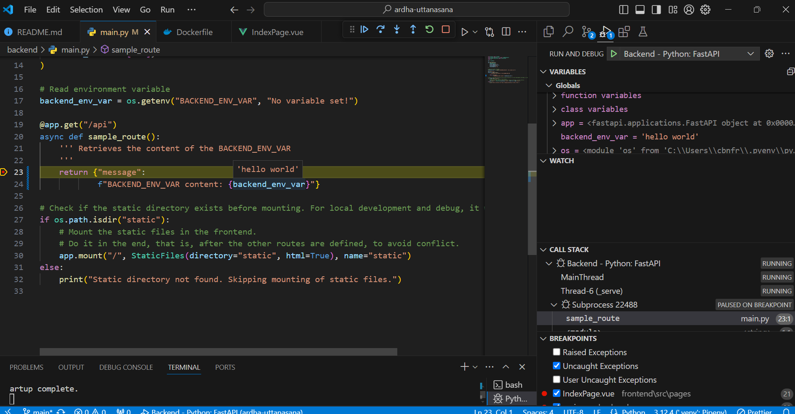
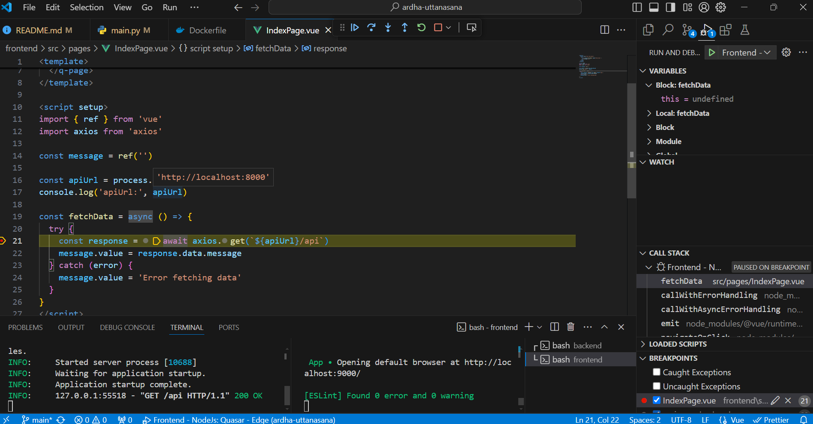
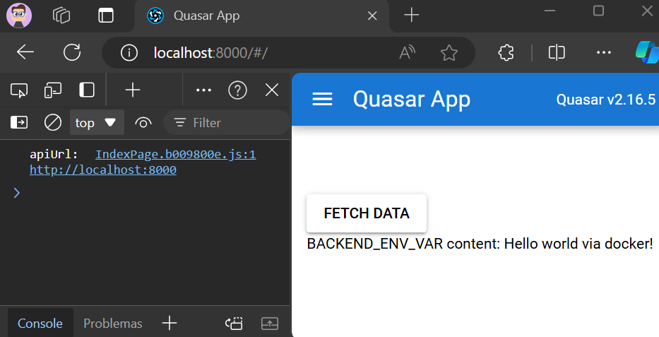
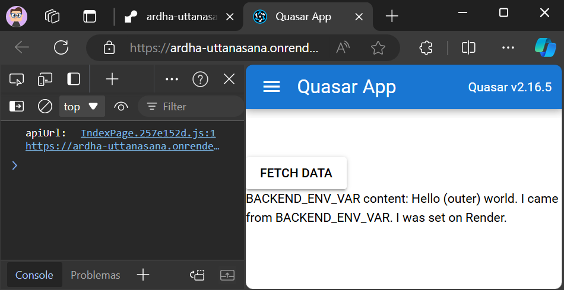

# Ardha-uttanasana

Este é um "Hello World" usando Python/[FastApi](https://fastapi.tiangolo.com/) no backend e VueJs/[Quasar](https://quasar.dev/) no frontend, rodando em um único container.

A principal contribuição aqui é mostrar como integrar essas tecnologias de duas maneiras:
- Execução e debug local com Vscode para facilitar a vida desenvolvedor.
- Deploy via um único Dockerfile. Portanto, **facilmente implantado em plataformas com planos gratuitos** (como [Render](https://render.com/)) como ponto de partida.

> Ardha-uttanasana é uma postura de yoga amigável para iniciantes, assim como este repositório 😉

Links do deploy:
- Frontend: https://ardha-uttanasana.onrender.com
- Backend: https://ardha-uttanasana.onrender.com/api
- Swagger: https://ardha-uttanasana.onrender.com/docs

## Requisitos
- Vscode
- Git bash
- Python 3.12, incluindo pipenv
- Node 18 ou superior
- Docker Desktop (para solucionar problemas do Dockerfile, se necessário)

## Execução e debug local

- Frontend: http://localhost:9000/
- Backend: http://localhost:8000/api
- Swagger: http://localhost:8000/docs

### Configuração do Backend
- Abra a pasta raiz deste projeto no VsCode e o terminal integrado (gitbash)
- `cd backend`
- `mkdir .venv` (para que o ambiente virtual seja instalado nesta subpasta).
- `pipenv install --dev`
- F1: Developer reload. Escolha o ambiente virtual que você acabou de instalar.

### Execução do Backend

- No terminal integrado, na pasta backend, digite `/run.sh` (ou `pipenv run uvicorn main:app --reload`)
- http://localhost:8000/api deve retornar

`{
    "message": "BACKEND_ENV_VAR content: No variable set!"
}`

- Se você encerrar o aplicativo (CTRL+C) e alterar a variável BACKEND_ENV_VAR via terminal (`export BACKEND_ENV_VAR="hello world"`), esse novo valor aparecerá na resposta.
- http://localhost:8000/docs deve mostrar a documentação do Swagger.

### Debug do Backend

- Coloque um breakpoint em `.\backend\main.py`, por exemplo, no retorno do sample_route.
- Em "Run and debug" (Ctrl+Shift+D), selecione Backend.
- Pressione F5 e vá para http://localhost:8000/api - Ele deve parar no seu breakpoint.

### Configuração do Frontend
- `cd frontend`
- `npm install`
- F1: Developer reload.

### Execução do Frontend
- Deixe o backend em execução.
- No terminal integrado, na pasta frontend, digite `/run.sh` (ou `quasar dev`)
- Vá para http://localhost:9000/#/

### Debug do Frontend
- Coloque um breakpoint em .`\frontend\src\pages\IndexPage.vue`, por exemplo, dentro de fetchData.
- Deixe o backend em execução.
- Deixe o frontend em execução e feche o navegador.
- Em "Run and debug" (Ctrl+Shift+D), selecione "Frontend".
- Pressione F5 e vá para http://localhost:9000/. Se você clicar no botão fetch data, ele deve parar no seu breakpoint.

## Executar o Docker localmente (opcional)
- Na pasta raiz deste projeto, no terminal integrado
- `docker build --no-cache --build-arg BACKEND_ENV_VAR="Hello world via docker!" -t myapp:latest .`
- `docker run -it --rm -p 8000:8000 --name myapp-container myapp:latest`
- Se tudo estiver funcionando, você verá o seguinte no navegador quando clicar no botão.

- Frontend: http://localhost:8000/
- Backend: http://localhost:8000/api
- Swagger: http://localhost:8000/docs

## Deploy no Render com Dockerfile

- Escolha New Web Server.
- Todas as configurações padrão.
- Adicione BACKEND_ENV_VAR como segredo.

## Lições aprendidas e notas

- É assim que se adicionam variáveis de ambiente no Quasar: https://quasar.dev/quasar-cli-webpack/handling-process-env#example.

- É necessário ajustar o Dockerfile para passar as variáveis para o container.

- Estas são as variáveis de ambiente disponíveis no Render: https://docs.render.com/environment-variables#by-runtime.

- Esse repo foi testado no Windows, mas acho que deve ser adaptável para Linux ou Mac sem muitos problemas.

- Se você precisar de um template full-stack, consulte https://github.com/tiangolo/full-stack-fastapi-template ❤️

- Obrigado à https://github.com/jonatasemidio/multilanguage-readme-pattern pela dica de documentação  multi-língua!
